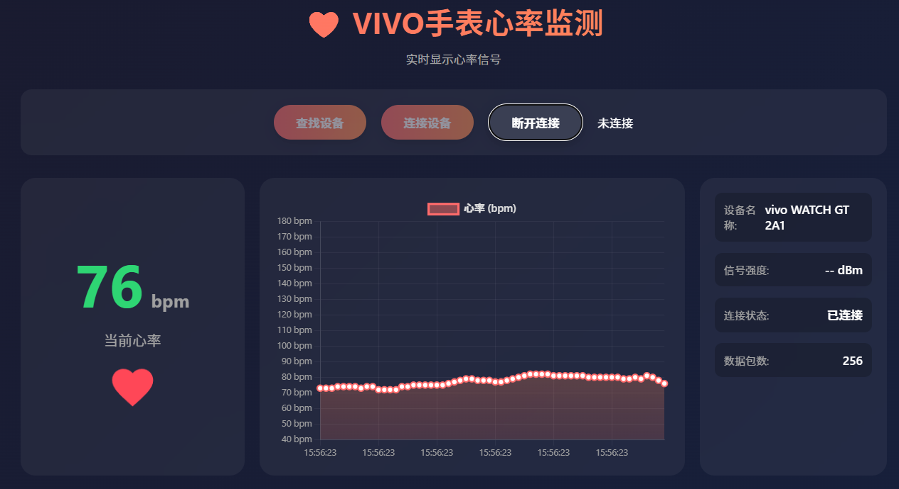

# VIVO手表心率监测Web应用



## 项目简介

这是一个基于Web Bluetooth API开发的实时心率监测Web应用，用于连接VIVO手表并实时显示心率数据。

## 功能特性

- ✅ **实时心率监测** - 通过BLE连接VIVO手表，实时显示心率数据
- ✅ **心率图表可视化** - 使用Chart.js绘制实时心率变化曲线
- ✅ **设备信息获取** - 自动获取电池电量和设备信息
- ✅ **响应式设计** - 支持多种屏幕尺寸，适配不同设备
- ✅ **美观的UI界面** - 现代化渐变设计，动态心率动画效果

## 技术栈

- **前端框架**: HTML5 + CSS3 + JavaScript (ES6+)
- **图表库**: Chart.js
- **蓝牙API**: Web Bluetooth API
- **服务器**: http-server

## 项目结构

```
Heart_view/
├── index.html          # 主页面
├── styles.css          # 样式文件
├── app.js              # 应用主逻辑
├── ble-manager.js      # BLE连接管理
├── heart-rate-display.js  # 心率显示组件
├── chart-manager.js    # 图表管理
├── package.json        # 项目配置
└── README.md           # 项目说明
```

## 使用方法

### 环境要求

- Chrome 56+ 或 Edge 79+ 浏览器
- 支持Web Bluetooth API的设备
- VIVO手表（需开启蓝牙）

### 运行步骤

1. 克隆或下载项目到本地

2. 安装依赖：
```bash
npm install
```

3. 启动本地服务器：
```bash
npx http-server -p 8080
```

4. 打开浏览器访问：`http://localhost:8080`

5. 点击"查找设备"按钮，选择VIVO手表进行连接

### 使用说明

1. **查找设备**: 点击"查找设备"按钮，系统会搜索附近的VIVO手表
2. **连接设备**: 选择手表后点击"连接设备"按钮建立连接
3. **查看数据**: 连接成功后，实时心率数据会显示在界面上
4. **断开连接**: 点击"断开连接"按钮结束连接

## 心率数据格式

应用使用标准的蓝牙心率服务（UUID: 0x180D）和心率特征值（UUID: 0x2A37）：

- **Flags**: 第1个字节，包含数据格式信息
  - Bit 0: 心率值格式（0=8位，1=16位）
  - Bit 1: 接触检测
  - Bit 3: 能量信息
  - Bit 4: RR间隔

- **Heart Rate**: 第2个字节（或第2-3字节），心率值（bpm）

## 其他功能

- **电池电量**: 自动获取并显示手表电池电量
- **设备信息**: 显示制造商和型号信息

## 浏览器支持

- ✅ Chrome 56+
- ✅ Edge 79+
- ⚠️ Firefox (需要手动启用)
- ❌ Safari (暂不支持)

## 注意事项

1. 确保VIVO手表已开启蓝牙并靠近电脑
2. 首次使用需要浏览器授权访问蓝牙设备
3. Web Bluetooth API只能在localhost或HTTPS环境下使用
4. 部分浏览器可能需要手动启用Web Bluetooth功能

## 更新日志

### v1.0.0 (2026-04-01)
- ✅ 实现BLE设备搜索和连接功能
- ✅ 实现心率数据实时显示
- ✅ 实现心率图表可视化
- ✅ 添加电池电量和设备信息获取
- ✅ 优化UI界面和用户体验

## 许可证

MIT License

## 作者

MzrQ1

## 相关链接

- [GitHub仓库](https://github.com/MzrQ1/VIVO_hpm_ViewOnWeb)
- [Web Bluetooth API文档](https://developer.mozilla.org/en-US/docs/Web/API/Web_Bluetooth_API)
